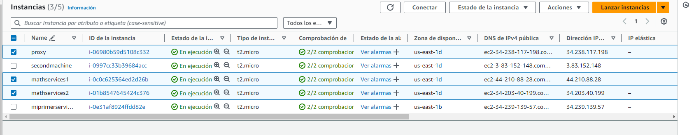

# PARCIAL 2
#### Hecho por: Daniel Santiago Gómez Zabala

Se va a crear la siguiente arquitectura, usando una tres instancias EC2 de AWS, dos de esas instancias albergarán los MathServices y la otra el proxy, prviamnete se tuvo que instalar java en las máquinas junto con maven y git para poder hacer la ejecución del servicio.


## GETTING STARTED

1. Debe tener instalado Maven en su computador para poder ejecutar los comandos que se le indicarán más adelante.
2. Debe contar con GITHUB para poder hacer uso del repositorio donde se alberga el laboratorio.
3. Debe tener un ambiente de java para poder visualizar y ejecutar el codigo.

## INSTALLING

Debe clonar el respositorio para poder hacer uso de la app con el comando que se encuentra a continuación

```
https://github.com/sagomezab/Parcial2_AREP.git
```

En este caso la clonación del repo será para visualizar lo realizado y la ejecución de cada Tarea

## Test

Dentro del broswer debe ingresar con los siguinetes URL para comprobar el correcto funcionamiento del servicio, a continuación se adjuntará una imagen con los resultados de las pruebas:


Con los siguientes enlaces:

* LOCAL

    Para obtener directamente el js sin el cliente html y js ingrese con los siguientes enlaces

    ```
    http://localhost:4567/factors?value=15
    http://localhost:4567/factors?value=112
    http://localhost:4567/primes?value=100
    ```

    

    Para ingresar con el formulario debe ingresar de la siguiente manera

    ```
    http://localhost:4567/formulario.html
    ```

    

* AWS

    Para obtener directamente el js sin el cliente html y js ingrese con los siguientes enlaces

    ```
    http://ec2-34-238-117-198.compute-1.amazonaws.com:4567/factors?value=15
    http://ec2-34-238-117-198.compute-1.amazonaws.com:4567/factors?value=112
    http://ec2-34-238-117-198.compute-1.amazonaws.com:4567/primes?value=100
    ```

    

    Para ingresar con el formulario debe ingresar de la siguiente manera

    ```
    http://ec2-34-238-117-198.compute-1.amazonaws.com:4567/formulario.html
    ```

    


### Prueba Local

Para ejecutar las clases correspondientes debe usar los siguientes comandos desde el CMD (Simbolo del Sistema)

1. Ejecute *mvn package* se utiliza para empaquetar el proyecto y generar el archivo de distribución definido en el proyecto, como un archivo JAR (Java ARchive), un archivo WAR (Web ARchive), o un archivo de distribución de otro tipo según la configuración del proyecto.

2. Ejecute cada clase individualemente con los isguientes comandos

    ```
    java -cp "target/classes:target/dependency/*" edu.escuelaing.arem.ASE.app.MathService

    java -cp "target/classes:target/dependency/*" edu.escuelaing.arem.ASE.app.Proxy
    ```


### Prueba en AWS

Para el despliegue en AWS se utilizo una instancia de EC2 en la cual se realizaron ejecuciones de maquina virtuales de java para poder ejecutar y permitir la interacción de los servicios

Debe tener previamente instalado maven, java y git en la instancia para poder realizar las siguiente pruebas

1. Abra tres veces la instancia de AWS y clone el repositorio con el siguiente enlace

    ```
    git clone https://github.com/sagomezab/Parcial2_AREP.git
    ```

2. Ejecute las clases involucradas para el funcionamiento del sistema con lo siguientes comandos (*Reecuerde realizar mvn package o mvn clean install antes de ejecutar las clases*):

    ```
    java -cp "target/classes:target/dependency/*" edu.escuelaing.arem.ASE.app.MathService

    java -cp "target/classes:target/dependency/*" edu.escuelaing.arem.ASE.app.Proxy
    ```
    Se debe ver de la siguiente manera en la ejecución en las instancias de EC2

    

3. Ingrese al siguiente enlace y compruebe el funcionamiento, en el value coloque el valor que desea y visualizará el resultado

    ```
    http://ec2-34-238-117-198.compute-1.amazonaws.com:4567/factors?value=
    http://ec2-34-238-117-198.compute-1.amazonaws.com:4567/primes?value=
    ```

    Debe visualizar lo siguiente
    

    Para ingresar directamente con el formulario debe usar el siguiente enlace:

    ```
    http://ec2-34-238-117-198.compute-1.amazonaws.com:4567/formulario.html
    ```

    Visualizará lo siguiente:
    

4. Se adjunta un imagen con las instancias creadas (3 instancias de EC2), dentro de las tres insnacias se instaló previamente java, git y maven para la ejecución de los servicios.

    

### Video

* [Video Probatorio](https://youtu.be/F0Qr3nJr5P4)

## Built With

* [Maven](https://maven.apache.org/) - Administrador de dependencias

## Author

Daniel Santiago Gómez Zabala [SAGOMEZAB](https://github.com/sagomezab)

## Acknowledgments

### Código
* **Proxy.java** Esta haciendo un llamado a round robin para distribuir los servidores activos, en esta clase se encuentra dos endoint que corresponden a los factores y a los primos.
* **RoundRobin.java** Esta reailizando un alternancia entre las url puestas estaticamente, este servicios esta siendo invocado por el proxy y cuando con dos metodos que realizan individualmente las operaciones solicitadas
* **MathService.java** En esta clase se estan realizando las operaciones de factorewsy primos de un número que entra por parametro. Esto se visualiza con dos endpoints.

### AWS
Una instancia EC2 de Amazon Web Services (AWS) es un servidor virtual que puedes lanzar en la nube de AWS. Estas instancias te permiten ejecutar aplicaciones y trabajar con sistemas operativos de tu elección, en este caso fue Linux.
